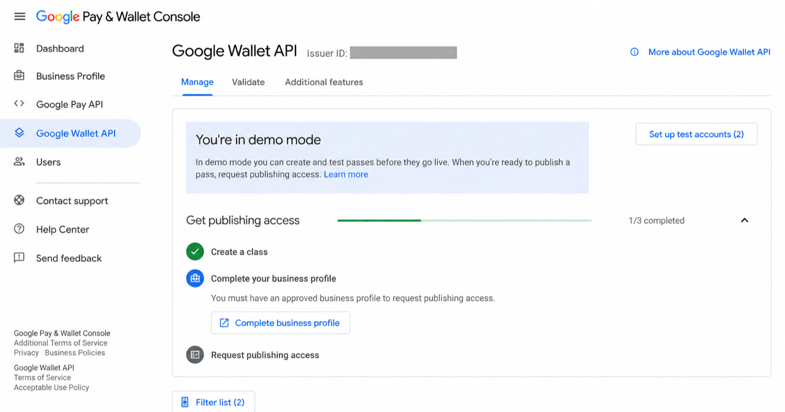
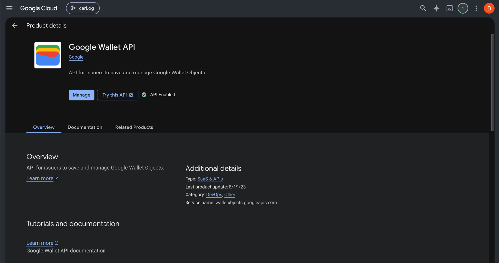
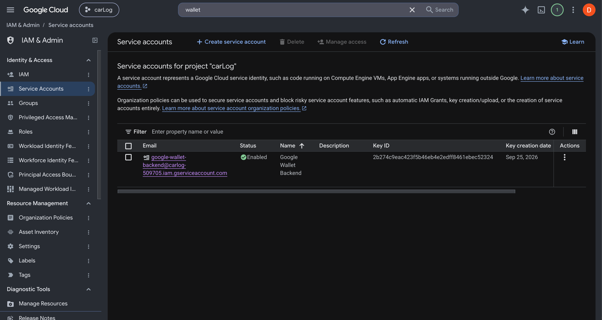
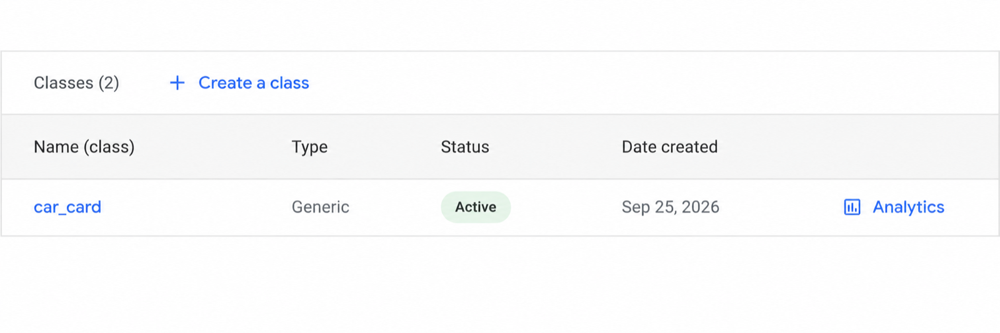
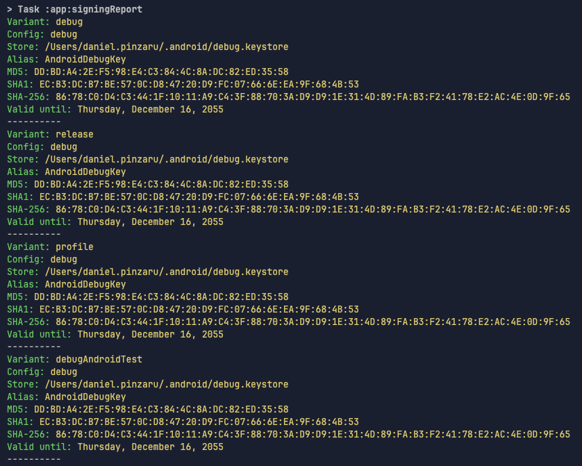
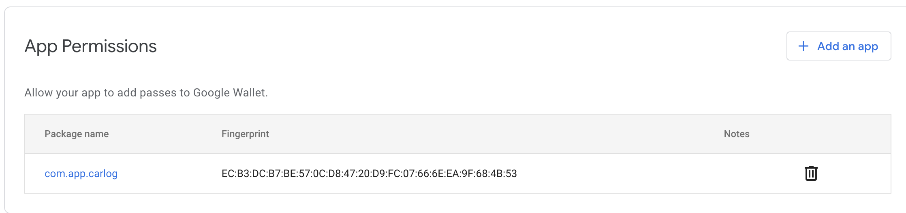
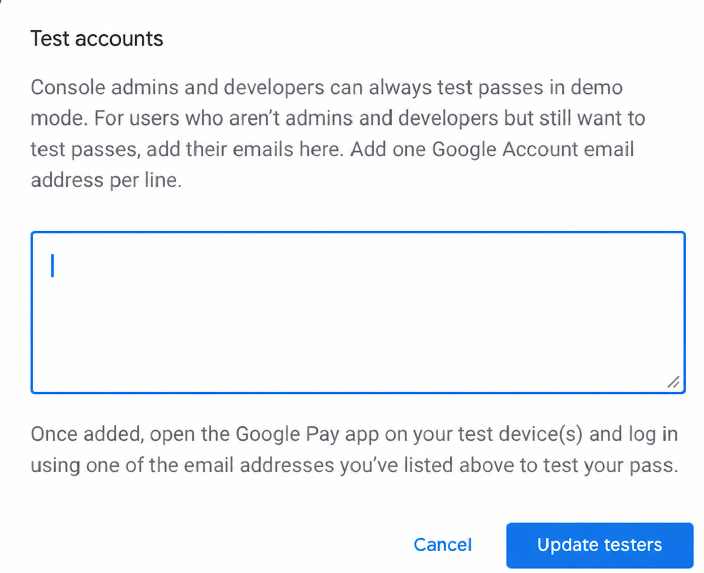

# Wallet Pass Integration Guide

This guide describes the existing Android integration using
[`add_to_google_wallet`](https://pub.dev/packages/add_to_google_wallet), the
unified Android/iOS option provided by
[`flutter_wallet_kit`](https://pub.dev/packages/flutter_wallet_kit), the
recommended production backend, and Apple Wallet integration.

> [!WARNING]
> Never include a Google service-account JSON key, Apple pass-signing private
> key, certificate password, or generated signing secret in Flutter assets,
> source control, an APK, or an IPA. Mobile application bundles can be read by
> users. Signing credentials belong on a backend or secure CI system.

> [!NOTE]
> Screenshots in this guide are cropped and redact account, project, issuer,
> package, and signing identifiers. Use values from your own environments.

## Architecture

Current Android testing can use an unsigned Wallet JWT. Google Play services
authenticates it using the Android application's registered package name and
signing-certificate SHA-1 fingerprint.

Production should use a backend for both wallet platforms:

```text
Flutter application
    |
    | authenticated request containing vehicle/pass identifier
    v
Application backend
    |-- Google Wallet: build object + sign JWT with service account
    |-- Apple Wallet: build .pkpass + sign with Pass Type certificate
    v
Platform wallet UI
    |-- Android: Google Wallet
    `-- iOS: Apple Wallet
```

The backend approach protects credentials, validates business data, produces
stable object identifiers, and supports later pass updates.

## Unified Flutter package

New cross-platform integrations can use `flutter_wallet_kit`:

```yaml
dependencies:
  flutter_wallet_kit: ^0.0.1
```

```dart
import 'package:flutter_wallet_kit/flutter_wallet_kit.dart';
```

The package supports Android API 24+ and iOS 15+. It provides one API for:

- Google Wallet unsigned metadata through `PayClient.savePasses`.
- Backend-signed Google Wallet JWTs through `PayClient.savePassesJwt`.
- Signed Apple `.pkpass` bytes through `PKAddPassesViewController`.
- Wallet availability checks, typed results, and native platform buttons.

Shared application code can provide both platform values. Native code uses only
the value for the current platform:

```dart
const wallet = FlutterWalletKit();

final supported = await wallet.isWalletSupported();
if (!supported) return;

final result = await wallet.addPass(
  iosPassData: pkpassBytes,
  androidJwt: signedGoogleWalletJwt,
);

if (result == WalletResult.success) {
  // Pass added successfully.
}
```

For Android metadata mode, provide `androidPassJson` instead of `androidJwt`, or
use `wallet.addGoogleWalletPass(pass)`. Never provide both Android values in one
call. Apple still requires fully generated and signed `.pkpass` bytes. Google
signed-JWT mode still requires backend signing.

## Android: Google Wallet

### 1. Add Flutter dependency

Add the package to `presentation/pubspec.yaml`:

```yaml
dependencies:
  add_to_google_wallet: ^0.0.5
```

Then run:

```bash
cd presentation
flutter pub get
```

Import the button:

```dart
import 'package:add_to_google_wallet/widgets/add_to_google_wallet_button.dart';
```

This package supports Android only. It calls the native Google Wallet Android
SDK and displays a localized Add to Google Wallet button. Developers wanting
one Android/iOS API can use `flutter_wallet_kit` from the previous section.

### 2. Create a Google Wallet issuer account

1. Open the [Google Pay & Wallet Console](https://pay.google.com/business/console).
2. Sign in using the account that should administer the issuer.
3. Complete the business profile and accept the Google Wallet API terms.
4. Open **Google Wallet API**.
5. Record the numeric **Issuer ID**.

New issuers start in Demo Mode. Only Admin users, Developer users, and listed
test accounts can save Demo Mode passes. Public issuance requires publishing
approval.



*Google Wallet issuer dashboard. Demo Mode permits testing before publishing
access is approved.*

Verify that:

- Issuer account exists.
- Demo Mode status is visible.
- Business Profile and publishing access are completed before production.

### 3. Enable the Google Wallet API

In the matching Google Cloud project:

1. Open **APIs & Services → Library**.
2. Find **Google Wallet API**.
3. Enable it.

OAuth 2.0 client credentials are not required for this Android SDK integration.
Android SDK requests use the app package and signing certificate. Backend REST
requests use a service account.



*Google Wallet API enabled in the Google Cloud project used by the issuer.*

### 4. Create and authorize a service account

A service account is needed for backend REST operations and signed JWTs.

Create the account in Google Cloud:

1. In Google Cloud, open **IAM & Admin → Service Accounts**.
2. Create a dedicated Google Wallet service account.
3. Copy its `client_email`.



*This confirms service-account creation in Google Cloud only. It does not prove
that the account has Google Wallet Developer access.*

Authorize the account in Google Pay & Wallet Console:

1. Open **Users**.
2. Invite the service-account email.
3. Assign **Developer** access.

For backend development, create a service-account key only if workload identity
or another keyless mechanism is unavailable. Store the key outside the repo.
Revoke exposed keys immediately.

> **Screenshot needed — Google Wallet Console user permissions**
>
> Add screenshot showing the service-account email with **Developer** access
> under Google Pay & Wallet Console → Users.

### 5. Create a Generic pass class

A class is a shared template. An object is one user's or one vehicle's pass.

1. Open **Google Wallet API → Manage**.
2. Select **Create a class**.
3. Choose **Generic**.
4. Choose a stable class suffix, for example `car_card`.
5. Save the class and confirm its status is Active.

Full class ID format:

```text
ISSUER_ID.car_card
```

Do not send only `car_card` or `GenericClass` as `classId`. Google requires the
numeric issuer prefix.



*Configured class: `car_card` — Generic — Active.*

### 6. Authorize the Android application

Find signing fingerprints:

```bash
cd presentation/android
./gradlew signingReport
```



*`signingReport` provides the SHA-1 fingerprint for the certificate that signed
the locally installed build.*

In Google Pay & Wallet Console:

1. Open **Google Wallet API → Additional features**.
2. Under **App Permissions**, select **Add an app**.
3. Enter the Android `applicationId`, for example `com.app.carlog`.
4. Enter the SHA-1 fingerprint for the installed build.

Register every applicable certificate separately:

- Local debug certificate.
- Local/release upload certificate, if used directly.
- Google Play App Signing certificate for Play-distributed builds.

The SHA-1 must belong to the certificate that signed the APK installed on the
device. Registering the debug SHA-1 does not authorize a Play Store build.



*Wallet Console must contain the package name and SHA-1 matching the installed
application. Production builds distributed through Google Play require the
Google Play App Signing SHA-1, not only the debug or upload-key SHA-1.*

### 7. Configure Demo Mode test accounts

Under **Google Wallet API → Test accounts**:

1. Add the Google Account used by Google Wallet on the test device.
2. Select **Update testers**.
3. Confirm the same account is active inside Google Wallet.

Admins and Developers can already test. A service account does not need to be a
test-device account because it cannot sign in to the Wallet application.



*Add the Google Account used by Google Wallet on the physical test device. A
service-account email is not a device tester because a service account cannot
sign in to Google Wallet.*

### 8. Build an unsigned Wallet JWT for Android testing

Use `jsonEncode`; avoid hand-written JSON strings once pass data becomes
dynamic. Required JWT claims include `iss`, `aud`, `typ`, `iat`, `origins`, and
`payload`.

```dart
import 'dart:convert';

import 'package:uuid/uuid.dart';

const issuerId = 'YOUR_ISSUER_ID';
const issuerEmail = 'YOUR_SERVICE_ACCOUNT_CLIENT_EMAIL';
const classSuffix = 'car_card';
const classId = '$issuerId.$classSuffix';

String buildGoogleWalletPass({
  required String vehicleId,
  required String displayName,
}) {
  final objectSuffix = const Uuid().v4();
  final issuedAt = DateTime.now().millisecondsSinceEpoch ~/ 1000;

  return jsonEncode({
    'iss': issuerEmail,
    'aud': 'google',
    'typ': 'savetowallet',
    'iat': issuedAt,
    'origins': <String>[],
    'payload': {
      'genericObjects': [
        {
          'id': '$issuerId.$objectSuffix',
          'classId': classId,
          'genericType': 'GENERIC_TYPE_UNSPECIFIED',
          'state': 'ACTIVE',
          'hexBackgroundColor': '#4285F4',
          'cardTitle': {
            'defaultValue': {
              'language': 'en-US',
              'value': 'CarLog',
            },
          },
          'header': {
            'defaultValue': {
              'language': 'en-US',
              'value': displayName,
            },
          },
          'barcode': {
            'type': 'QR_CODE',
            'value': vehicleId,
          },
          'textModulesData': [
            {
              'id': 'vehicle_id',
              'header': 'VEHICLE ID',
              'body': vehicleId,
            },
          ],
        },
      ],
    },
  });
}
```

Object IDs must be unique within the issuer. For production, prefer a stable,
backend-controlled suffix derived from an immutable database ID. Avoid creating
a new object ID on every widget rebuild.

### 9. Display the button

Build the pass once per logical pass, then pass it to the widget:

```dart
final pass = buildGoogleWalletPass(
  vehicleId: vehicle.id,
  displayName: vehicle.name,
);

AddToGoogleWalletButton(
  pass: pass,
  onSuccess: () {
    // Show success UI or record local analytics.
  },
  onCanceled: () {
    // User closed the Google Wallet flow.
  },
  onError: (error) {
    // Log the complete SDK error during development.
    debugPrint('Google Wallet error: $error');
  },
)
```

Do not place pass creation directly in a frequently rebuilding widget if it
generates a random object ID. Store the generated payload in controller/state or
request it from the backend.

### 10. Android release checklist

- Google Wallet API enabled.
- Issuer account configured.
- Business profile complete.
- Generic class active.
- Production publishing access approved.
- Production package name registered.
- Google Play App Signing SHA-1 registered.
- Backend service account has Developer access.
- Demo-only labels removed from production content.
- Wallet brand/button guidelines followed.
- Error, cancellation, and retry paths tested.
- Pass object IDs stable and unique.
- Service-account keys absent from app and repository.

## Backend implementation

### Responsibilities

Recommended backend responsibilities:

- Authenticate the CarLog user.
- Verify user may issue a pass for the requested vehicle.
- Load canonical vehicle/pass data from the database.
- Create stable platform object identifiers.
- Build Google Wallet Generic Objects.
- Sign Google Wallet JWTs with RS256.
- Build and sign Apple `.pkpass` files.
- Update or expire issued passes.
- Keep signing credentials in a secret manager.
- Record issuance attempts without logging credentials or full private data.

### Suggested API

```http
POST /api/wallet/google/vehicles/{vehicleId}
Authorization: Bearer <user-session-token>
```

Example response:

```json
{
  "jwt": "eyJhbGciOiJSUzI1NiIs...",
  "objectId": "ISSUER_ID.vehicle_123"
}
```

For iOS:

```http
GET /api/wallet/apple/vehicles/{vehicleId}
Authorization: Bearer <user-session-token>
Accept: application/vnd.apple.pkpass
```

Response:

```http
Content-Type: application/vnd.apple.pkpass
Content-Disposition: attachment; filename="vehicle-123.pkpass"
```

### Google Wallet backend flow

1. Create the Generic class once, either in Wallet Console or through REST API.
2. Receive authenticated request from Flutter.
3. Build a Generic Object referencing the existing class ID.
4. Wrap object in Wallet JWT claims.
5. Sign JWT with service-account private key using RS256.
6. Return only signed JWT to Flutter.
7. Flutter opens the native save flow using an SDK/plugin that supports
   `savePassesJwt`.

For signed JWT delivery, the current `add_to_google_wallet` widget is not enough
by itself because its public API accepts unsigned JSON and calls `savePasses`.
Use `flutter_wallet_kit`, which exposes
`wallet.addPass(androidJwt: signedGoogleWalletJwt)`, or add a small native
platform channel around `savePassesJwt`.

JWT outline:

```json
{
  "iss": "SERVICE_ACCOUNT_CLIENT_EMAIL",
  "aud": "google",
  "typ": "savetowallet",
  "iat": 1234567890,
  "origins": [],
  "payload": {
    "genericObjects": [
      {
        "id": "ISSUER_ID.vehicle_123",
        "classId": "ISSUER_ID.car_card",
        "state": "ACTIVE"
      }
    ]
  }
}
```

Do not accept arbitrary pass JSON from the mobile client and sign it. Construct
claims from server-owned templates and validated database fields.

### Updates and revocation

Google Wallet passes can be updated through the REST API using their stable
object IDs. Examples:

- Change vehicle display data.
- Add a message.
- Update barcode value.
- Set state to `EXPIRED` when pass is no longer valid.

Store platform identifiers alongside the vehicle/pass record:

```text
vehicle_id
google_wallet_object_id
apple_pass_serial_number
wallet_issued_at
wallet_revoked_at
```

### Backend security

- Prefer workload identity over long-lived downloaded keys where available.
- Otherwise store service-account JSON in a managed secret store.
- Rotate keys periodically and immediately after exposure.
- Restrict service account to Wallet-specific responsibilities.
- Never return private keys or raw credentials to Flutter.
- Rate-limit pass issuance endpoints.
- Authorize every vehicle lookup against current user.
- Avoid personal data in logs, JWT debug output, and analytics.

## iOS: Apple Wallet

`add_to_google_wallet` does not support iOS. Apple Wallet requires a separate
PassKit integration.

### Apple Developer setup

An ordinary Apple Account used for iCloud is not sufficient to create Pass Type
ID certificates. The issuer must join the paid Apple Developer Program.

1. Join the paid Apple Developer Program as an individual or organization.
2. Create a **Pass Type ID**, for example `pass.com.example.carlog`.
3. Create a Pass Type ID certificate.
4. Export certificate and private key for secure backend use.
5. Download the current Apple Worldwide Developer Relations certificate when
   required by the signing toolchain.
6. If the app reads or manages installed passes, enable the **Wallet**
   capability for the Runner target and configure the required Pass Type IDs.

> **Screenshot needed — Apple Developer Pass Type ID**
>
> Add screenshot from Certificates, Identifiers & Profiles.

> **Screenshot needed — Apple Pass Type ID certificate**
>
> Add screenshot showing the certificate associated with the Pass Type ID.

> **Screenshot needed — Xcode Wallet capability**
>
> If the app reads or manages installed passes, add a screenshot showing
> Runner → Signing & Capabilities → Wallet.

### `.pkpass` structure

A `.pkpass` file is a signed ZIP package containing:

```text
pass.json
manifest.json
signature
icon.png
icon@2x.png
logo.png                 # optional, depending on design
logo@2x.png              # optional
strip.png / thumbnail.png / background.png  # pass-style dependent
```

`pass.json` contains identifiers, serial number, organization, colors, barcode,
display fields, expiration data, and optional update-service information.

The backend:

1. Creates pass assets and `pass.json`.
2. Calculates manifest hashes.
3. Signs the manifest using the Pass Type certificate and private key.
4. Packages everything as `.pkpass`.
5. Returns it with MIME type `application/vnd.apple.pkpass`.

Signing must not happen inside the Flutter application.

### Flutter/iOS save flow

Flutter should download the authenticated `.pkpass` bytes and pass them to
`flutter_wallet_kit`:

```dart
import 'package:flutter_wallet_kit/flutter_wallet_kit.dart';

const wallet = FlutterWalletKit();

final result = await wallet.addPass(iosPassData: pkpassBytes);
if (result == WalletResult.success) {
  // Pass added successfully.
}
```

The package presents Apple's native PassKit flow, equivalent to:

```swift
let pass = try PKPass(data: passData)
let controller = PKAddPassesViewController(pass: pass)
present(controller, animated: true)
```

Presenting `PKAddPassesViewController` lets the user explicitly review and add
the pass. This add-only flow does not require pass-library entitlement. Wallet
capability and pass-type entitlements are required when the app reads or
manages installed passes.

Required integration behavior:

- Accept pass bytes or local `.pkpass` path.
- Construct `PKPass`.
- Present `PKAddPassesViewController`.
- Return success, cancellation, or validation error.
- Optionally query whether a matching pass already exists.

> **Screenshot needed — Apple Wallet add-pass preview**
>
> Add screenshot from a physical iPhone showing the signed pass preview before
> the user confirms **Add**.

### Apple Wallet updates

To update installed Apple passes, include `webServiceURL` and
`authenticationToken` in `pass.json`, implement Apple's pass web-service
endpoints, and send Wallet update notifications through Apple's push service.
This is separate from normal application push notifications.

### iOS release checklist

- Pass Type ID created.
- Valid Pass Type certificate available on backend.
- Certificate expiration monitored.
- Wallet capability and entitlements configured when pass-library access is
  required.
- `.pkpass` validates on a physical iPhone.
- Correct MIME type returned.
- Pass artwork follows Apple requirements.
- Unique, stable serial numbers used.
- Update web service protected by per-pass authentication token.
- Certificates and keys absent from app bundle and repository.

## Troubleshooting

### `invalidJson: not a valid id`

Usually `id` or `classId` lacks issuer prefix.

Correct:

```text
ISSUER_ID.car_card
ISSUER_ID.vehicle_123
```

Incorrect:

```text
car_card
GenericClass
vehicle_123
```

### Google Wallet shows “Something went wrong”

Check:

- `iat` exists and uses current Unix seconds.
- `iss` matches authorized service-account email.
- Class exists, is Active, and belongs to same issuer.
- Object and class types match (`genericObjects` with Generic class).
- Installed APK certificate matches registered SHA-1.
- Active Wallet user is allowed in Demo Mode.
- Required fields `id`, `classId`, `state`, `cardTitle`, and `header` are valid.
- Image URLs are public HTTPS URLs and return valid images.

Start with a minimal pass without images. Add optional fields after it saves.

### Why `flutter_wallet_card.addToWallet()` failed on Android

Version 5.0.0 generates a standalone Google object rather than the complete
unsigned Wallet JWT expected by `PayClient.savePasses()`. That generated payload
lacks the required wrapper (`iss`, `aud`, `typ`, `iat`, `origins`, and
`payload.genericObjects`). Google therefore rejects it. The working
`add_to_google_wallet` integration supplies the complete structure.

## References

- [add_to_google_wallet package](https://pub.dev/packages/add_to_google_wallet)
- [flutter_wallet_kit package](https://pub.dev/packages/flutter_wallet_kit)
- [Google Wallet issuer onboarding](https://developers.google.com/wallet/generic/getting-started/issuer-onboarding)
- [Authorize an Android app](https://developers.google.com/wallet/generic/getting-started/auth/android)
- [Google Wallet JWT structure](https://developers.google.com/wallet/generic/use-cases/jwt)
- [Google Wallet REST credentials](https://developers.google.com/wallet/generic/getting-started/auth/rest)
- [Google Wallet Generic Object reference](https://developers.google.com/wallet/reference/rest/v1/genericobject)
- [Apple: Building a pass](https://developer.apple.com/documentation/walletpasses/building-a-pass)
- [Apple: PKAddPassesViewController](https://developer.apple.com/documentation/passkit/pkaddpassesviewcontroller)
